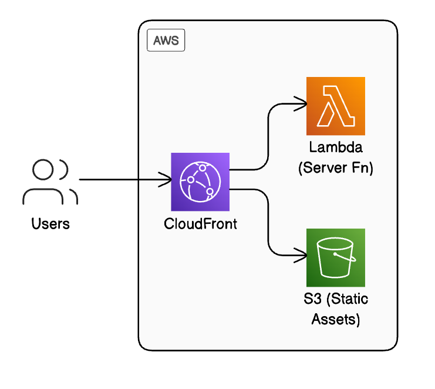

# TanStack Start on AWS CDK

A simple starter template for deploying [TanStack Start](https://tanstack.com/start) applications on AWS using the AWS Cloud Development Kit (CDK).

## Background

This repository demonstrates a serverless approach to hosting TanStack Start applications on AWS. It combines:

- **TanStack Start**: A modern, full-stack web framework built on React, Vite, and TypeScript
- **AWS CDK**: Infrastructure as code toolkit for defining cloud resources using familiar programming languages

The goal is to provide a minimal working example that can serve as a starting point for your own projects.

## Architecture



The architecture follows a simple serverless pattern:

- **CloudFront**: Acts as the CDN and entry point for all user requests
- **Lambda**: Hosts the TanStack Start server-side code
- **S3 Bucket**: Stores static assets (CSS, JavaScript, images)

This setup provides several benefits:
- Serverless architecture with pay-per-use pricing
- Global content delivery via CloudFront
- Automatic scaling based on traffic
- No server management required

## Getting Started

### Prerequisites

- Node.js v22 or later
- AWS CLI configured with appropriate credentials
- Basic knowledge of TanStack Start and AWS CDK

### Project Structure

```
├── app/                 # TanStack Start application
├── cdk/                 # AWS CDK infrastructure code
├── .github/             # GitHub specific files
├── .vscode/             # VSCode settings
└── package.json         # Root package.json for workspace management
```

### Installation

```bash
# Clone the repository
git clone https://github.com/yourusername/tanstack-start-aws-cdk.git
cd tanstack-start-aws-cdk

# Install dependencies
npm install
```

### Local Development

```bash
# Start the TanStack Start development server
npm run dev
```

### Deployment

```bash
# Deploy to development environment
npm run deploy:dev

# Deploy to staging environment
npm run deploy:staging

# Deploy to production environment
npm run deploy:prod
```

## Customization

This starter uses basic configurations for both TanStack Start and AWS CDK. You can customize it by:

1. Modifying the TanStack Start application in the `app/` directory
2. Adjusting the CDK infrastructure in `cdk/lib/root-stack.ts`
3. Adding environment-specific configurations in `cdk/bin/cdk.ts`

## Limitations

This is a basic starter template and has some limitations:

- No custom domain setup (uses CloudFront and Lambda default domains)
- Minimal security configurations
- No CI/CD pipeline included

## Contributing

Contributions are welcome! Feel free to open issues or submit pull requests.

## License

This project is open source and available under the [MIT License](LICENSE).
